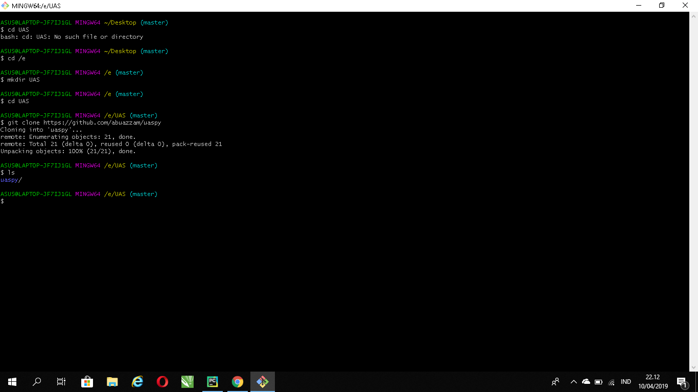
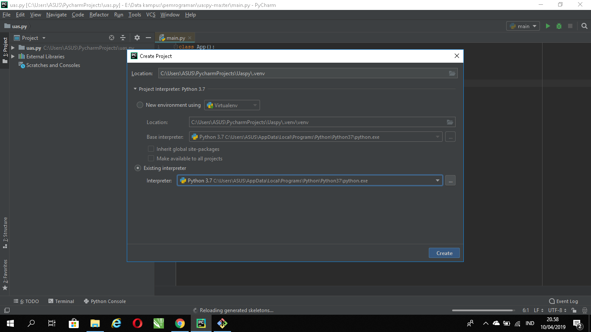
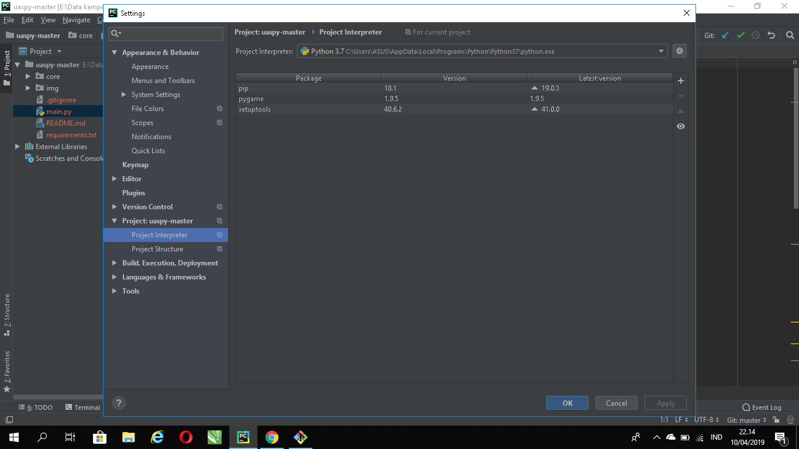
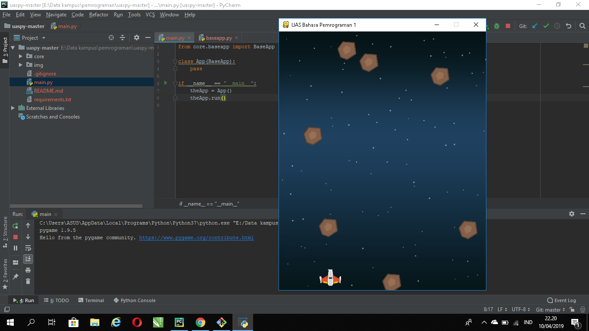
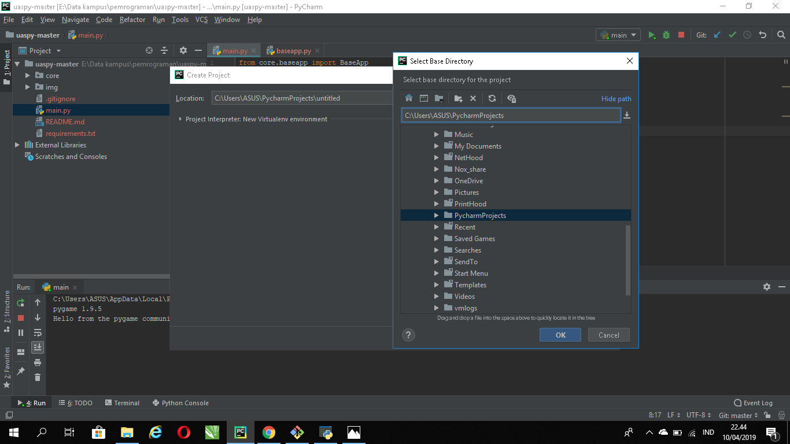

# UAS

* I. Lakukan fork dari repository berikut:https://github.com/abuazzam/uaspy, Kemudian clone 
# <h2>

* II. Lakukan konfigurasi Virtual environment pada project anda
# <h2>

* III. Install requirements yang dibutuhkan (pip install atau dari PyCharm).*
# <h2>

* IV. Install requirements yang dibutuhkan (pip install atau dari PyCharm).*
# <h2>

* V. Install requirements yang dibutuhkan (pip install atau dari PyCharm).*
# <h2>
